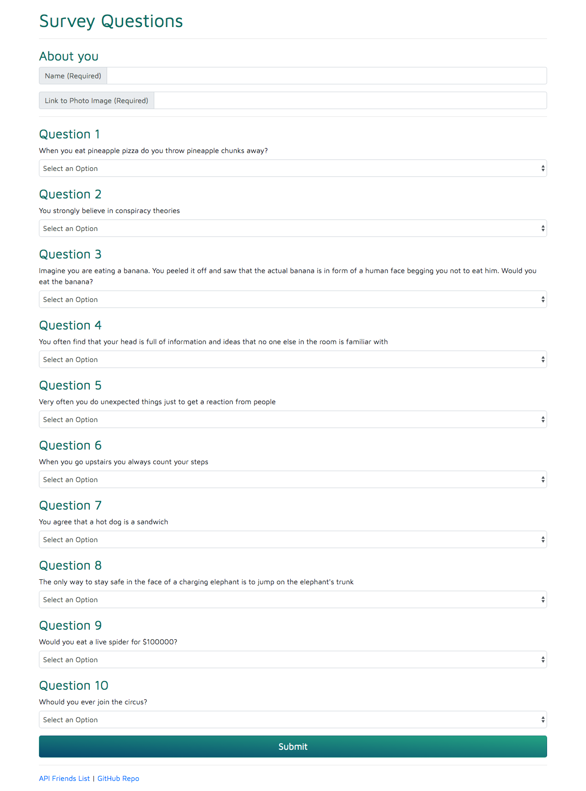

# FriendFinder

## How this app works

FriendFinder application шы basically a dating app. This full-stack site takes in results from users' surveys, then compares their answers with those from other users. The app then displays the name and picture of the user with the best overall match.

A survey has 10 questions. Each answer is on a scale of 1 to 5 based on how much the user agrees or disagrees with a question.

## Tech:

- [node.js]
- [express.js]

I think the biggest technical challenge was to write an algorithm to handle the compatibility logic of the survey result, as well as to create modular, mountable route handlers.

## Screenshots:

